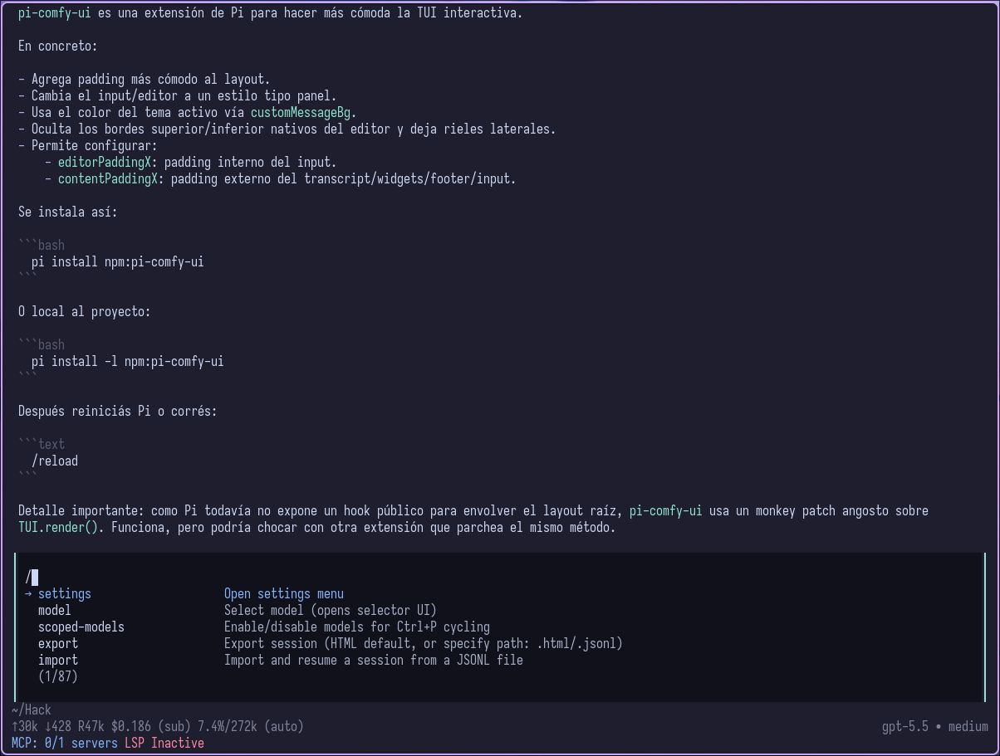

# pi-comfy-ui

Comfortable input and interactive panel styling for Pi's interactive TUI.



## Install

```bash
pi install npm:pi-comfy-ui
```

Project-local install only:

```bash
pi install -l npm:pi-comfy-ui
```

Then restart Pi, or run `/reload` if Pi is already open.

For project-local installs, Pi loads this extension only after the project is approved/trusted. The first trust prompt itself uses Pi's default styling; pi-comfy-ui applies after approval.

## Configure

pi-comfy-ui only styles Pi's TUI. It does not read, set, or override Pi padding settings.

For spacing, configure Pi's native settings directly. These values usually feel best with pi-comfy-ui:

```json
{
  "editorPaddingX": 1,
  "outputPad": 1
}
```

Settings locations:

- Global/user settings: `~/.pi/agent/settings.json`
- Project/local settings: `.pi/settings.json` (overrides global)

Padding notes:

- `editorPaddingX` is Pi's native inner input/editor padding.
- `outputPad` is Pi's native horizontal padding for user messages, assistant messages, and thinking output.
- pi-comfy-ui no longer supports `contentPaddingX`, `layoutPaddingX`, or `PI_CONTENT_PADDING_X` because Pi already provides native padding settings.
- Outer terminal padding should be configured in your terminal emulator, for example Ghostty/WezTerm/kitty terminal padding options.

Styling notes:

- The input/editor background is painted from the active theme token `customMessageBg`.
- Interactive prompt panels, such as settings, model selection, confirms, selects, and structured questions, are painted from the active theme token `userMessageBg`.
- The input/editor keeps Pi's original editor border color, but renders that border on the left and right sides only; Pi's native top/bottom editor border is hidden.
- Interactive prompt panels keep Pi's original border line color, but replace the top/bottom border shape with left/right side rails.
- If another extension already provides a custom editor, pi-comfy-ui keeps that editor and does not replace it.

## How it works

pi-comfy-ui uses Pi's public custom editor API, `ctx.ui.setEditorComponent()`, and extends Pi's `CustomEditor` so app-level keybindings and native `editorPaddingX` behavior continue to work.

Pi does not currently expose a public root-layout wrapper hook for extensions. Earlier versions of pi-comfy-ui used a root render monkey patch for both `contentPaddingX` and interactive panel styling. The root/content padding behavior has been removed.

Interactive panel styling still uses a narrow TUI render patch because Pi does not expose a dedicated panel-rendering extension API yet. That patch only rewrites detected dynamic-border panels into pi-comfy-ui side-rail panels. It does not change render width, does not add outer padding, and does not read `contentPaddingX`.

For transcript/output spacing, use Pi's built-in `outputPad` setting instead of extension-level root padding.
